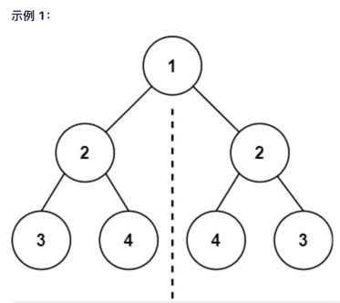
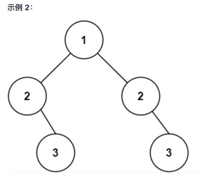

101. 对称二叉树

给你一个二叉树的根节点 root ， 检查它是否轴对称。

输入：root = [1,2,2,3,4,4,3]
输出：true

输入：root = [1,2,2,null,3,null,3]
输出：false

提示：

树中节点数目在范围 [1, 1000] 内
-100 <= Node.val <= 100

进阶：你可以运用递归和迭代两种方法解决这个问题吗？

来源：力扣（LeetCode）
链接：https://leetcode-cn.com/problems/symmetric-tree
著作权归领扣网络所有。商业转载请联系官方授权，非商业转载请注明出处。